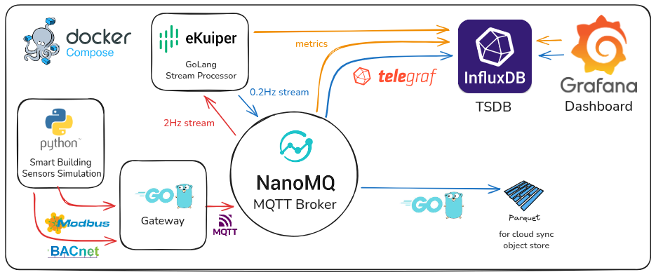

# Smart Building Edge Telemetry System

A lightweight, edge-focused real-time telemetry system for smart building sensor data using industry-standard open-source components.

## 🏗️ Architecture



## 📊 Project Components

### Technology Stack

| Component | Technology | Purpose |
|-----------|-----------|---------|
| Protocol Simulator | Python (bacpypes3, pymodbus) | BACnet/IP and Modbus TCP servers |
| Protocol Gateway | Golang (gobacnet, goburrow/modbus) | Real protocol client and MQTT bridge |
| MQTT Broker | NanoMQ (LF Edge) | Lightweight message transport |
| Stream Processing | eKuiper (LF Edge) | Real-time data aggregation |
| Data Bridge | Telegraf | MQTT to InfluxDB pipeline |
| File Writer | Parquet Golang Bridge | MQTT to Parquet files |
| Time-Series DB | InfluxDB 2.7 | Persistent storage |
| Visualization | Grafana | Dashboards and analytics |

### 1. Sensor Simulator (Python)
- **Real Protocol Implementation**: BACnet/IP server and Modbus TCP server
- **8 Unique Room Profiles**: Conference rooms, offices, server room, cafeteria, and more
- **BACnet Sensors**: Temperature, humidity, CO2, air quality (analog value objects)
- **Modbus Sensors**: Light, energy, motion, occupancy (holding registers)
- **Update Rate**: 10Hz internal updates for realistic sensor behavior

### 2. Golang Gateway (Real Protocol Client)
- **Type**: Custom Golang gateway service
- **Protocols**: BACnet/IP client and Modbus TCP client
- **Function**: Polls BACnet and Modbus sensors and aggregates by room then publishes to NanoMQ
- **Polling Rate**: 500ms (2Hz) per room configurable
- **Buffering**: No buffering, fire-and-forget with no aknowledgment

### 3. NanoMQ
- **Type**: LF Edge ultra-lightweight MQTT broker
- **Protocols**: MQTT
- **Function**: Enabling pub/sub decoupling between sensor data and consumers
- **Topics**:
   1. `telemtry/#` *gateway publishes each room to these topics*
   2. `ds_telemetry/#` *ekuiper donwsample rooms telemtry and publish back to these topics*

### 4. eKuiper (Stream Processing)
- **Type**: LF Edge lightweight edge streaming SQL engine
- **Function**: Real-time downsampling and aggregation
- **Input**: Raw 2Hz streams from `telemetry/#`
- **Processing**: 5-second hopping windows (10s window, 5s hop)
- **Aggregations**: 
  - AVG for continuous metrics (temperature, humidity, CO2, light, energy, air quality)
  - MAX for discrete counts (occupancy_count)
  - CASE WHEN for boolean conversion (motion_detected: true/false → 1/0)
- **Output**: Publishes downsampled 0.2Hz streams to `ds_telemetry/#`
- **Data Reduction**: 90% (16 msgs/sec → 1.6 msgs/sec)
- **No persistence**: Pure stream processing, no file writing

### 5. Telegraf (Data Bridge)
- **Type**: Plugin-driven data collection agent
- **Function**: Multi-purpose data collector:
  1. MQTT consumer → InfluxDB writer (sensor data)
  2. HTTP poller → InfluxDB (eKuiper rule metrics)
  3. Prometheus scraper → InfluxDB (NanoMQ metrics)
- **Inputs**:
  - MQTT: Subscribes to `ds_telemetry/#` topics → `sensor_data` bucket
  - HTTP: Polls eKuiper rules status every 15s → `monitoring_ekuiper` bucket
  - Prometheus: Scrapes NanoMQ metrics every 15s → `monitoring_nanomq` bucket
- **Output**: Writes to InfluxDB with proper tags and fields
- **Benefits**: Production-ready, no custom code needed

### 6. Parquet Golang Bridge
- **Type**: Custom Golang MQTT consumer and Parquet file writer
- **Function**: MQTT consumer → Parquet file writer for long-term storage and cloud sync
- **Input**: Subscribes to `ds_telemetry/#` topics
- **Output**: Writes to compressed Parquet files with Snappy compression
- **File Rotation**: Hourly rotation by default (configurable via `FILE_ROTATION_SEC`)
- **Storage**: `/data/parquet/` directory
- **Performance**: Efficient columnar storage, minimal memory footprint

### 7. InfluxDB (Time-Series Database)
- **Organization**: `smart-building`
- **Buckets**:
  1. `sensor_data` (30-day retention) - Room telemetry data
  2. `monitoring_ekuiper` (7-day retention) - eKuiper rule metrics
  3. `monitoring_nanomq` (7-day retention) - NanoMQ broker metrics
- **Data Models**:
  - **sensor_telemetry**:
    - Tags: `room_id`
    - Fields: `temperature`, `humidity`, `co2_ppm`, `light_lux`, `occupancy_count`, `motion_detected`, `energy_kwh`, `air_quality_index`
  - **ekuiper_rule**:
    - Tags: `rule_name`, `component`
    - Fields: `status`, `records_in_total`, `records_out_total`, `exceptions_total`, `process_latency_us`
  - **nanomq_metrics**:
    - Tags: `component`
    - Fields: `connections_count`, `sessions_count`, `topics_count`, `subscribers_count`, `messages_received`, `messages_sent`, `messages_dropped`, `memory_usage`, `cpu_usage`

### 8. Grafana (Visualization)
- **Dashboards**:
  1. **Smart Building Dashboard** - Room telemetry visualization
     - Room selector dropdown (filter by room_id)
     - 6 time-series line charts (temperature, humidity, CO2, light, energy, air quality)
     - 1 gauge panel (current occupancy)
     - 1 state timeline (motion detection)
  2. **Monitoring Dashboard** - System health and performance
     - **NanoMQ Metrics**: Active connections, sessions, topics, subscribers, message throughput, memory usage, CPU usage
     - **eKuiper Metrics**: Rule status table, total exceptions, records processed per rule, processing latency
- **Data Sources**: 3 InfluxDB datasources (sensor_data, monitoring_ekuiper, monitoring_nanomq)
- **Auto-refresh**: Every 5 seconds

## 📁 Project Structure

```
smart-building/
├── config/
│   ├── nanomq.conf                             # NanoMQ broker configuration
│   ├── rooms.yaml                              # Room definitions (8 rooms with floor, zone, sensors)
│   ├── sensors.yaml                            # Sensor definitions (protocol, address, object IDs)
│   └── telegraf.conf                           # Telegraf MQTT→InfluxDB bridge config
├── data/
│   └── parquet/                                # Parquet files written by golang-bridge
├── ekuiper/
│   └── etc/
│       ├── init.json                           # eKuiper streams and rules auto-loaded at startup
│       └── mqtt_source.yaml                    # MQTT source configuration
├── golang-bridge/
│   ├── Dockerfile
│   ├── go.mod
│   └── main.go                                 # Parquet writer (MQTT → Parquet files)
├── golang-gateway/
│   ├── Dockerfile
│   ├── go.mod
│   └── main.go                                 # Protocol gateway (BACnet/Modbus → MQTT)
├── grafana/
│   └── provisioning/
│       ├── dashboards/
│       │   ├── dashboard.yaml                  # Dashboard provisioning config
│       │   ├── smart-building-dashboard.json   # Pre-built sensor dashboard
│       │   └── monitoring-dashboard.json       # Pre-built monitoring dashboard
│       └── datasources/
│           └── influxdb.yaml                   # InfluxDB datasource config (3 buckets)
├── influxdb/
│   └── init/
│       └── init-influxdb.sh                    # Bucket creation script (sensor_data, monitoring_ekuiper, monitoring_nanomq)
├── sensor-simulator/
│   ├── Dockerfile
│   ├── main.py                                 # BACnet/Modbus server implementation
│   ├── requirements.txt                        # Python dependencies (bacpypes3, pymodbus)
│   └── sensors.py                              # Sensor behavior models
├── docker-compose.yml                          # Service orchestration
└── README.md
```

## 🌐 UI URLs

- **Grafana**: http://localhost:3000 (admin/admin)
  - Smart Building Dashboard: Pre-configured sensor visualization
  - Monitoring Dashboard: NanoMQ and eKuiper health metrics
- **InfluxDB UI**: http://localhost:8086 (admin/admin123456)
  - Buckets: sensor_data, monitoring_ekuiper, monitoring_nanomq
- **eKuiper REST API**: http://localhost:9081
  - List all rules: `http://localhost:9081/rules`
  - Rule status: `http://localhost:9081/rules/downsample_room_01/status`
  - List streams: `http://localhost:9081/streams`
- **eKuiper Management Console**: http://localhost:20498
- **NanoMQ HTTP API**: http://localhost:8081
  - Prometheus metrics: `http://localhost:8081/api/v4/prometheus`

## 🐳 Docker Services

| Service | Port(s) | Description |
|---------|---------|-------------|
| sensor-simulator | 47808 (BACnet), 5020 (Modbus) | Python BACnet/Modbus protocol servers |
| golang-gateway | - | Real BACnet/Modbus client with MQTT publisher |
| nanomq | 1883, 8083, 8081 | Ultra-lightweight MQTT broker from LF Edge (includes Prometheus metrics endpoint) |
| ekuiper | 9081, 20498 | Edge stream processing SQL engine from LF Edge (includes REST API for monitoring) |
| telegraf | - | Data collection agent (sensor data + system monitoring → InfluxDB) |
| parquet-golang-bridge | - | Golang MQTT consumer → Parquet writer |
| influxdb | 8086 | Time-series database (3 buckets: sensor_data, monitoring_ekuiper, monitoring_nanomq) |
| grafana | 3000 | Visualization and dashboards (sensor dashboard + monitoring dashboard) |

## 📈 Data Flow & eKuiper Downsampling
Protocol Layer (Sensor Simulator)
- **BACnet Objects**: Analog Value objects on port 47808
- **Modbus Registers**: Holding registers on port 5020
- **Update Rate**: 10 Hz internal sensor value updates

### Gateway Layer (Golang Gateway)
- **Polling**: Reads BACnet/Modbus sensors every 500ms
- **Aggregation**: Combines 8 sensor readings per room into single telemetry message
- **Output**: Publishes to MQTT at 2 Hz per room

### Raw Telemetry (MQTT)
- **Frequency**: 2 Hz (every 0.5 seconds)
- **Topics**: `telemetry/01` - `telemetry/08`
- **Volume**: 16 messages/second total (8 rooms × 2 Hz)
- **Source**: Golang gateway aggregated from real protocols
- **Volume**: 16 messages/second total (8 rooms × 2 Hz)

### Downsampled Telemetry
- **Frequency**: 0.2 Hz (every 5 seconds)
- **Topics**: `ds_telemetry/01` - `ds_telemetry/08`
- **Volume**: 1.6 messages/second total (8 rooms × 0.2 Hz)
- **Reduction**: 90% fewer messages
- **Aggregations**:
  - Temperature, humidity, CO2, light, energy, air quality: AVG
  - Occupancy count: MAX (captures peak activity)
  - Motion detected: CASE WHEN (converts boolean to 1/0 for InfluxDB)
  - Timestamp: Latest in window

### eKuiper Configuration Files
- `ekuiper/etc/mqtt_source.yaml`: MQTT source configuration
- `ekuiper/etc/init.json`: Stream and rule definitions loaded at startup
- Rules configured to publish only to MQTT topics (no file sinks)

### File Details
- **Compression**: Snappy (fast compression/decompression)
- **Rotation**: Hourly by default (configurable via `FILE_ROTATION_SEC`)
- **Format**: Columnar storage optimized for analytical queries
- **Naming**: `sensor_telemetry_YYYYMMDD_HHMMSS.parquet`

---

## 🔬System Monitoring & Observability

The platform includes comprehensive monitoring of the edge stream processing infrastructure to ensure reliability and performance visibility.

### Monitoring Architecture

```
┌─────────────┐     Prometheus      ┌──────────────┐
│   NanoMQ    │────────Metrics───────>│              │
│   Broker    │     (HTTP scrape)    │              │
└─────────────┘                      │              │
                                     │   Telegraf   │
┌─────────────┐     REST API         │   (Collector)│
│   eKuiper    │─────Status JSON─────>│              │
│   Engine    │     (HTTP poll)      │              │
└─────────────┘                      └──────┬───────┘
                                            │
                                            v
                                     ┌─────────────┐
                                     │  InfluxDB   │
                                     │             │
                                     │ • monitoring│
                                     │   _ekuiper  │
                                     │ • monitoring│
                                     │   _nanomq   │
                                     └──────┬──────┘
                                            │
                                            v
                                     ┌─────────────┐
                                     │   Grafana   │
                                     │  Monitoring │
                                     │  Dashboard  │
                                     └─────────────┘
```

### NanoMQ Metrics (MQTT Broker Health)

**Collection Method**: Telegraf scrapes Prometheus-format metrics from NanoMQ HTTP API every 15 seconds

**Metrics Tracked**:
- **Connections**: Active MQTT client connections (gateway, eKuiper, telegraf, bridge)
- **Sessions**: Persistent MQTT sessions
- **Topics**: Number of active topics (`telemetry/#`, `ds_telemetry/#`)
- **Subscribers**: Active topic subscriptions
- **Message Throughput**: Messages received/sent/dropped per second (calculated via derivative)
- **Resource Usage**: Memory usage (current and max), CPU usage percentage

**Use Cases**:
- Detect broker overload or connection issues
- Monitor message flow and processing rates
- Alert on dropped messages indicating capacity problems
- Track resource consumption for capacity planning

### eKuiper Metrics (Stream Processing Health)

**Collection Method**: Telegraf polls eKuiper REST API for each rule status every 15 seconds

**Metrics Tracked** (per rule):
- **Rule Status**: running, stopped, or error state
- **Source Metrics**: Records in/out, processing latency (microseconds), connection status, exceptions
- **Sink Metrics**: Records in/out, exceptions
- **Timestamps**: Last start/stop time

**Use Cases**:
- Verify all 8 downsampling rules are running
- Detect stream processing failures or disconnections
- Monitor processing latency to ensure real-time performance
- Track data loss via exception counters
- Validate data flow from source (MQTT) to sink (MQTT publish)

### Monitoring Dashboard Features

**NanoMQ Section**:
- 4 stat panels: Connections, Sessions, Topics, Subscribers (current values)
- 1 timeseries chart: Message throughput (received/sent/dropped over time)
- 1 timeseries chart: Memory usage (current and max)
- 1 timeseries chart: CPU usage percentage

**eKuiper Section**:
- 1 table panel: Rule status for all 8 downsampling rules (name, status, timestamp)
- 1 stat panel: Total exceptions across all rules (alert indicator)
- 1 bar gauge: Records processed per rule (throughput comparison)
- 1 timeseries chart: Processing latency per rule (performance monitoring)

**Telegraf Configuration**:
- **Input plugins**: `inputs.mqtt_consumer`, `inputs.http`, `inputs.prometheus`
- **Output plugins**: `outputs.influxdb_v2` (3 separate outputs with bucket routing via `namepass`)
- **Processors**: `processors.regex` (extracts rule name from URL for tagging)

---

## 🔬 Deep Dive: Sensor Simulator & Gateway Architecture

This section provides a detailed technical explanation of how the sensor simulator and gateway services work, covering the real protocol implementations, data flow, and architectural decisions.

### 1. Sensor Simulator: Real BACnet/IP and Modbus TCP Server

#### **Overview**
The sensor simulator is not a simple JSON message generator—it implements **real building automation protocols** (BACnet/IP and Modbus TCP) using production-grade libraries. This allows the gateway to use standard industrial protocol clients without any custom adapters.

#### **Architecture**

```
┌─────────────────────────────────────────────────────────────┐
│                   Sensor Simulator Container                 │
│  ┌──────────────────────────────────────────────────────┐   │
│  │              SimulatorCoordinator                     │   │
│  │  - Loads sensor & room configs (YAML)                │   │
│  │  - Creates sensor objects with realistic behavior    │   │
│  │  - Maps sensors to BACnet objects & Modbus registers │   │
│  └─────────────┬────────────────────────┬────────────────┘   │
│                │                        │                     │
│  ┌─────────────▼──────────┐  ┌─────────▼──────────────┐     │
│  │   BACnetSimulator      │  │   ModbusSimulator      │     │
│  │   (bacpypes3)          │  │   (pymodbus)           │     │
│  │                        │  │                        │     │
│  │  Port: 47808           │  │  Port: 5020            │     │
│  │  Protocol: BACnet/IP   │  │  Protocol: Modbus TCP  │     │
│  └────────────────────────┘  └────────────────────────┘     │
└─────────────────────────────────────────────────────────────┘
         │                              │
         │ UDP/IP (BACnet)             │ TCP/IP (Modbus)
         │                              │
         ▼                              ▼
   [Golang Gateway Clients]
```

#### **BACnet Implementation (bacpypes3)**

The simulator uses the **bacpypes3** library to create a fully compliant BACnet/IP server:

**Object Model:**
- Each sensor is represented as a **BACnet Analog Value Object** with a unique `objectIdentifier`
- Object IDs are mapped in `sensors.yaml`: temperature sensors (101-108), humidity (201-208), CO2 (301-308), air quality (401-408)
- Each object exposes standard BACnet properties: `presentValue`, `statusFlags`, `eventState`, `units`

**Key Code (main.py):**
```python
# Create BACnet Analog Value Object
avo = AnalogValueObject(
    objectIdentifier=('analogValue', object_id),
    objectName=f'sensor_{object_id}',
    presentValue=Real(sensor.get_value()),
    statusFlags=[0, 0, 0, 0],
    eventState='normal',
    outOfService=False,
    units='noUnits'
)
self.app.add_object(avo)
```

**Update Loop:**
- Runs asynchronously at **10 Hz** (every 100ms)
- Updates the `presentValue` property of each BACnet object by calling `sensor.get_value()`
- This allows external BACnet clients to read current sensor values using standard BACnet Read Property requests

**Protocol Details:**
- Transport: BACnet/IP (UDP) on port **47808**
- Device instance: 47808
- Vendor ID: 999
- Supports Who-Is/I-Am discovery
- Responds to Read Property requests for Present Value

#### **Modbus Implementation (pymodbus)**

The Modbus simulator uses **pymodbus** to implement a Modbus TCP server:

**Register Model:**
- Sensors mapped to **holding registers** (function code 3/16)
- Register addresses defined in `sensors.yaml`: light (500-508), energy (600-608), motion (700-708), occupancy (800-808)
- Values stored as 16-bit integers (scaled by 100 for decimal precision)

**Key Code (main.py):**
```python
# Create Modbus holding register datastore
block = ModbusSequentialDataBlock(0, [0] * 1000)
store = ModbusSlaveContext(hr=block)
self.datastore = ModbusServerContext(slaves=store, single=True)

# Update loop: write sensor values to registers
scaled_value = int(value * 100)  # Float to int conversion
self.datastore[0].setValues(3, register, [scaled_value])
```

**Update Loop:**
- Also runs at **10 Hz** (every 100ms)
- Reads sensor values and writes them to the corresponding holding registers
- Scaling: multiply by 100 (e.g., 12.34 → 1234) to preserve 2 decimal places

**Protocol Details:**
- Transport: Modbus TCP on port **5020**
- Slave ID: 1 (single slave context)
- Function codes supported: Read Holding Registers (0x03)
- No authentication required (typical for local networks)

#### **Sensor Behavior Models**

Each sensor type has **realistic simulation logic** in `sensors.py`:

**TemperatureSensor:**
- Gradual drift with configurable rate
- Random fluctuations (±0.1°C)
- Bounds checking (18-28°C)
- Drift direction changes randomly

**HumiditySensor:**
- Correlated with temperature changes
- Bounded between 30-70%

**CO2Sensor:**
- Responds to occupancy count
- Multiplier: `1.0 + (occupancy * 0.1)`
- Exponential approach to target value
- Range: 400-2000 ppm

**LightSensor:**
- Binary states (on/off) with occasional transitions
- On: 300-600 lux, Off: 0-50 lux

**EnergySensor:**
- Cumulative counter (kWh)
- Configurable consumption rate
- Never resets (realistic meter behavior)

**MotionSensor:**
- Boolean output (0 or 1)
- Random state transitions

**OccupancySensor:**
- Integer count with gradual changes (±1 per update)
- Bounded by max occupancy per room

---

### 2. Golang Gateway: Real Protocol Client & MQTT Bridge

#### **Overview**
The gateway is a **production-grade Golang service** that acts as a protocol translator between building automation networks (BACnet/Modbus) and the IoT message bus (MQTT). It uses real protocol libraries to poll sensors and aggregates readings per room.

#### **Architecture**

```
┌────────────────────────────────────────────────────────────┐
│                    Golang Gateway                           │
│                                                              │
│  ┌──────────────────────────────────────────────────────┐  │
│  │          Configuration Layer                          │  │
│  │  - sensors.yaml: 64 sensors (8 types × 8 rooms)     │  │
│  │  - rooms.yaml: 8 rooms with sensor assignments      │  │
│  └──────────────────────────────────────────────────────┘  │
│                            │                                │
│  ┌─────────────────────────▼───────────────────────────┐  │
│  │          Protocol Clients (Concurrent)               │  │
│  │                                                       │  │
│  │  ┌─────────────────┐      ┌─────────────────┐      │  │
│  │  │ BACnet Client   │      │ Modbus Client   │      │  │
│  │  │ (gobacnet)      │      │ (goburrow)      │      │  │
│  │  │                 │      │                 │      │  │
│  │  │ • WHO-IS/IAM   │      │ • Read Holding  │      │  │
│  │  │ • Read Property │      │   Registers     │      │  │
│  │  │ • 32 sensors    │      │ • 32 sensors    │      │  │
│  │  └────────┬────────┘      └────────┬────────┘      │  │
│  │           │ 500ms poll             │ 500ms poll    │  │
│  └───────────┼────────────────────────┼───────────────┘  │
│              │                        │                   │
│  ┌───────────▼────────────────────────▼───────────────┐  │
│  │          Reading Store (thread-safe map)           │  │
│  │  - Last reading per sensor with timestamp          │  │
│  │  - Status: ok | error | stale                      │  │
│  └────────────────────────┬───────────────────────────┘  │
│                            │                              │
│  ┌────────────────────────▼───────────────────────────┐  │
│  │        Room Aggregator (500ms interval)            │  │
│  │  - Combines 8 sensor readings per room             │  │
│  │  - Applies type mapping (sensor → telemetry field) │  │
│  │  - Generates JSON telemetry messages                │  │
│  └────────────────────────┬───────────────────────────┘  │
│                            │                              │
│  ┌────────────────────────▼───────────────────────────┐  │
│  │          MQTT Publisher                             │  │
│  │  - Topic: telemetry/{room_id}                       │  │
│  │  - QoS: 0 (at most once)                            │  │
│  │  - Rate: 2 Hz per room (16 msg/sec total)          │  │
│  └─────────────────────────────────────────────────────┘  │
└────────────────────────────────────────────────────────────┘
```

#### **BACnet Client Implementation**

**Library:** `github.com/alexbeltran/gobacnet`

**Initialization:**
```go
client, err := gobacnet.NewClient(interfaceName, 0)
// interfaceName: "eth0" or network interface
// Port: Defaults to 47808 (standard BACnet/IP)
```

**Reading Process:**
1. **Device Discovery** (cached):
   - Resolves sensor address to UDP address
   - Creates `types.Device` with network address
   - Cached in thread-safe map for reuse

2. **Read Property Request:**
```go
rp := types.ReadPropertyData{
    Object: types.Object{
        ID: types.ObjectID{
            Type:     types.AnalogValue,
            Instance: types.ObjectInstance(sensor.ObjectID),
        },
        Properties: []types.Property{
            {Type: property.PresentValue, ArrayIndex: gobacnet.ArrayAll},
        },
    },
}
resp, err := client.ReadProperty(device, rp)
```

3. **Value Parsing:**
   - Extracts `presentValue` from response
   - Type assertion for numeric types (float32/64, int32/64, uint32/64)
   - Error handling for invalid/missing properties

**Concurrency:**
- Each sensor has a **dedicated goroutine** for polling
- Mutex-protected access to shared BACnet client (prevents concurrent UDP writes)
- Device cache protected by RWMutex (many readers, rare writers)

#### **Modbus Client Implementation**

**Library:** `github.com/goburrow/modbus`

**Initialization:**
```go
handler := modbus.NewTCPClientHandler(address)  // "sensor-simulator:5020"
handler.Timeout = 2 * time.Second
handler.IdleTimeout = 60 * time.Second
handler.Connect()
```

**Reading Process:**
1. **Read Holding Register:**
```go
client := modbus.NewClient(handler)
results, err := client.ReadHoldingRegisters(uint16(register), 1)
// Returns 2 bytes (16-bit register value)
```

2. **Value Decoding:**
```go
rawValue := uint16(results[0])<<8 | uint16(results[1])
floatValue := float64(rawValue) / 100.0  // Reverse scaling
```

**Connection Pooling:**
- Single TCP handler shared across all Modbus sensors
- Automatic reconnection on connection loss
- Idle timeout for resource cleanup

#### **Polling & Aggregation Strategy**

**Per-Sensor Polling:**
- Each sensor runs in a separate goroutine
- Poll interval: **500ms** (configurable per sensor in `sensors.yaml`)
- Ticker-based scheduling ensures consistent timing

**Reading Storage:**
```go
type SensorReading struct {
    SensorID   string
    RoomID     string
    Type       string
    Value      float64
    Unit       string
    Timestamp  time.Time
    Status     string  // "ok", "error", "stale"
}
lastReadings map[string]*SensorReading  // Thread-safe with RWMutex
```

**Room Aggregation:**
- Runs every **500ms** (minimum sensor poll interval)
- For each room:
  1. Retrieve last reading for each assigned sensor
  2. Filter out error/stale readings
  3. Map sensor type to telemetry field:
     - `temperature` → `Temperature`
     - `humidity` → `Humidity`
     - `co2` → `CO2PPM`
     - `air_quality` → `AirQualityIndex`
     - `light` → `LightLux`
     - `energy` → `EnergyKWH`
     - `motion` → `MotionDetected` (bool)
     - `occupancy` → `OccupancyCount` (int32)
  4. Create `RoomTelemetry` JSON message
  5. Publish to MQTT

**Telemetry Message Structure:**
```json
{
  "room_id": "01",
  "temperature": 21.5,
  "humidity": 45.2,
  "co2_ppm": 650,
  "light_lux": 450,
  "occupancy_count": 3,
  "motion_detected": true,
  "energy_kwh": 2.45,
  "air_quality_index": 85,
  "timestamp": "2026-02-05T14:32:10Z"
}
```

#### **MQTT Publishing**

**Configuration:**
- Broker: `tcp://nanomq:1883`
- Client ID: `golang-gateway`
- Auto-reconnect: Enabled
- QoS: 0 (fire-and-forget for high throughput)
- Retain: False

**Topic Structure:**
```
telemetry/01  ← Conference Room A
telemetry/02  ← Open Office Space
telemetry/03  ← Server Room
...
telemetry/08  ← Storage Closet
```

**Publishing Rate:**
- 2 Hz per room (every 500ms)
- 8 rooms = **16 messages/second** total

#### **Error Handling & Resilience**

**Protocol Errors:**
- BACnet: Retries on network timeout, logs malformed responses
- Modbus: Connection pool handles reconnection automatically
- Failed reads marked as `status: "error"` but don't block polling

**Graceful Shutdown:**
```go
shutdown chan struct{}  // Signal channel
wg sync.WaitGroup       // Wait for goroutines

// On SIGINT/SIGTERM:
close(shutdown)         // Signal all pollers to stop
wg.Wait()               // Wait for completion
client.Disconnect()     // Clean disconnect from MQTT
bacnetClient.Close()    // Release BACnet socket
modbusHandler.Close()   // Close Modbus connection
```

**Stale Data Detection:**
- Each reading has a timestamp
- Aggregator can filter readings older than threshold
- Status transitions: `ok` → `stale` → `error`

---

### 3. Data Flow Summary

**End-to-End Pipeline:**

```
1. Sensor Objects (Python)
   └─ Update at 10 Hz (every 100ms)
   └─ Realistic behavior models

2. Protocol Servers (Python)
   └─ BACnet: UDP port 47808, Analog Value objects
   └─ Modbus: TCP port 5020, Holding registers

3. Gateway Clients (Golang)
   └─ Poll at 2 Hz (every 500ms)
   └─ 64 concurrent sensor pollers

4. Gateway Aggregation (Golang)
   └─ Combine 8 sensors per room
   └─ Publish to MQTT at 2 Hz

5. MQTT Broker (NanoMQ)
   └─ Lightweight message routing
   └─ Topics: telemetry/01-08

6. Stream Processing (eKuiper)
   └─ Downsample 2 Hz → 0.2 Hz
   └─ 90% data reduction

7. Persistence Layer
   ├─ Telegraf → InfluxDB (time-series queries)
   └─ Parquet Bridge → Files (long-term analytics)

8. Visualization (Grafana)
   └─ Real-time dashboards
   └─ InfluxDB queries
```

**Latency Breakdown:**
- Sensor update → Gateway poll: **< 500ms** (poll interval)
- Gateway poll → MQTT publish: **< 10ms** (local network)
- MQTT publish → eKuiper process: **< 50ms** (stream processing)
- eKuiper → Telegraf → InfluxDB: **< 100ms** (write batching)
- **Total: < 700ms end-to-end**

---

### 4. Key Design Decisions

**Why Real Protocols?**
- Demonstrates authentic industrial IoT architecture
- Gateway code is production-ready (can connect to real devices)
- Educational value for building automation engineers
- No proprietary adapters needed

**Why Golang for Gateway?**
- Excellent concurrency primitives (goroutines, channels)
- Strong ecosystem for industrial protocols (gobacnet, modbus)
- Low memory footprint (<50MB with 64 concurrent pollers)
- Fast startup and deterministic GC
- Native cross-compilation for edge devices

**Why Python for Simulator?**
- bacpypes3 and pymodbus are mature, well-documented libraries
- Rapid prototyping of sensor behaviors
- Easy YAML configuration parsing
- Asyncio for non-blocking server loops

**Scalability Considerations:**
- Current setup: 8 rooms × 8 sensors = 64 pollers = **~16 msg/sec** raw data
- With eKuiper downsampling: **1.6 msg/sec** to persistence layer
- Could scale to **100+ rooms** with same architecture (1,600 msg/sec → 160 msg/sec)
- Bottleneck would be InfluxDB write throughput, not gateway/broker

**Why 2 Hz Polling?**
- Matches typical HVAC control loop frequencies (0.5-5 Hz)
- Fast enough for occupancy/motion detection
- Slow enough to avoid overwhelming low-power sensors
- Configurable per sensor type in YAML

This architecture provides a realistic, scalable foundation for smart building telemetry with industry-standard protocols and modern edge processing patterns.