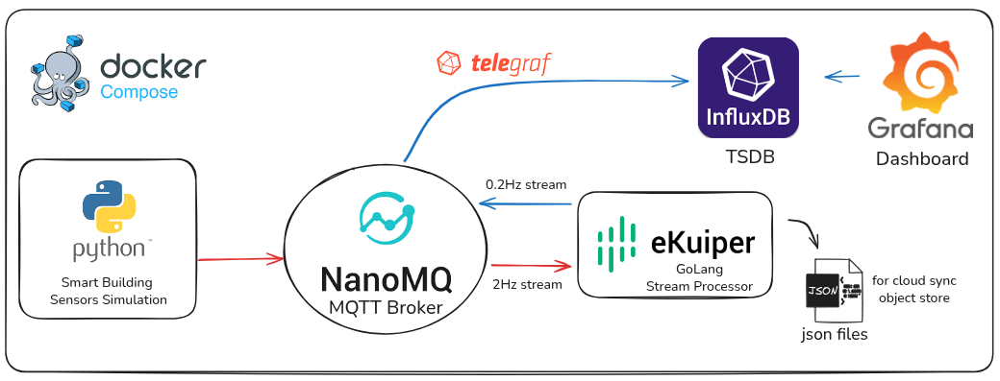

# Smart Building Edge Telemetry System

A lightweight, edge-focused real-time telemetry system for smart building sensor data using industry-standard open-source components.

## 🏗️ Architecture



## 📊 Project Components

### 1. Sensor Simulator (Python)
- **8 Unique Room Profiles**: Server room, conference room, storage, office, kitchen, lab, break room, executive office
- **Metrics**: Temperature, humidity, CO2, light, occupancy, motion, energy, air quality
- **Publishing Rate**: 0.5s intervals (2 messages/sec per room = 16 msgs/sec total)
- **Topics**: `telemetry/01` through `telemetry/08`

### 2. NanoMQ (MQTT Broker)
- **Type**: Ultra-lightweight MQTT broker from LF Edge
- **Protocol**: MQTT 3.1.1 on port 1883, WebSocket on port 8083
- **Role**: Message transport layer for sensor data

### 3. eKuiper (Stream Processing)
- **Type**: Lightweight edge streaming SQL engine from LF Edge  
- **Function**: Real-time downsampling and aggregation
- **Input**: Raw 2Hz streams from `telemetry/#`
- **Processing**: 5-second hopping windows (10s window, 5s hop)
- **Aggregations**: 
  - AVG for continuous metrics (temperature, humidity, CO2, light, energy, air quality)
  - MAX for discrete counts (occupancy_count)
  - CASE WHEN for boolean conversion (motion_detected: true/false → 1/0)
- **Output**: Downsampled 0.2Hz streams to `ds_telemetry/#`
- **Data Reduction**: 90% (16 msgs/sec → 1.6 msgs/sec)

### 4. Telegraf (Data Bridge)
- **Type**: Plugin-driven data collection agent
- **Function**: MQTT consumer → InfluxDB writer
- **Input**: Subscribes to `ds_telemetry/#` topics
- **Output**: Writes to InfluxDB v2 with proper tags and fields
- **Benefits**: Production-ready, no custom code needed

### 5. InfluxDB (Time-Series Database)
- **Version**: InfluxDB 2.7
- **Organization**: `smart-building`
- **Bucket**: `sensor_data` (30-day retention)
- **Data Model**: 
  - Measurement: `sensor_telemetry`
  - Tags: `room_id`
  - Fields: `temperature`, `humidity`, `co2_ppm`, `light_lux`, `occupancy_count`, `motion_detected`, `energy_kwh`, `air_quality_index`
  - Timestamp: from sensor data

### 6. Grafana (Visualization)
- **Dashboards**: Single unified dashboard with room selector
- **Visualizations**:
  - 6 time-series line charts (temperature, humidity, CO2, light, energy, air quality)
  - 1 gauge panel (current occupancy)
  - 1 state timeline (motion detection)
- **Data Source**: InfluxDB with Flux queries
- **Auto-refresh**: Every 5 seconds

## 🏠 Room Profiles

| Room ID | Name | Characteristics |
|---------|------|-----------------|
| 01 | Server Room | Cool (18-20°C), low humidity, always "occupied", high energy |
| 02 | Conference Room | Variable temp/humidity, burst occupancy, variable energy |
| 03 | Storage Closet | Always dark, stable temp, no occupancy, minimal energy |
| 04 | Open Office | Moderate temp, consistent occupancy (5-8), moderate energy |
| 05 | Kitchen | High humidity spikes, temp spikes, high energy bursts |
| 06 | Lab/Workshop | Highly variable everything, air quality issues |
| 07 | Break Room | Stable temp, low occupancy, variable lighting |
| 08 | Executive Office | Perfectly controlled, single occupancy, consistent |

## 📋 Data Schema

### Raw Telemetry Message (JSON)
```json
{
  "room_id": "01",
  "timestamp": "2026-02-01T10:30:45.500Z",
  "temperature": 19.2,
  "humidity": 35.5,
  "co2_ppm": 450,
  "light_lux": 0,
  "occupancy_count": 0,
  "motion_detected": false,
  "energy_kwh": 2.3,
  "air_quality_index": 95
}
```

### Downsampled Message (Aggregated over 5 seconds)
```json
{
  "room_id": "01",
  "timestamp": "2026-02-01T10:30:50.000Z",
  "temperature": 19.18,
  "humidity": 35.42,
  "co2_ppm": 448.5,
  "light_lux": 0,
  "occupancy_count": 0,
  "motion_detected": 0,
  "energy_kwh": 2.31,
  "air_quality_index": 94.8
}
```

## 🚀 Quick Start

### Prerequisites
- Docker & Docker Compose
- 2GB+ RAM recommended
- 5GB+ disk space

### Startup

1. **Start all services**
```bash
docker-compose up -d
```

2. **Verify services are running**
```bash
docker-compose ps
```

All services should show as "Up":
- smart-building-nanomq
- smart-building-sensor-simulator
- smart-building-ekuiper
- smart-building-telegraf
- smart-building-influxdb
- smart-building-grafana

3. **Access the dashboard**
- Grafana: http://localhost:3000 (admin/admin)
- InfluxDB UI: http://localhost:8086 (admin/admin123456)
- eKuiper UI: http://localhost:20498

## 📁 Project Structure

```
smart-building/
├── config/
│   ├── nanomq.conf          # NanoMQ broker configuration
│   └── telegraf.conf        # Telegraf MQTT→InfluxDB bridge config
├── data/
│   └── ekuiper/             # eKuiper file sink outputs (downsampled JSONL files)
├── ekuiper/
│   └── etc/
│       ├── init.json        # eKuiper streams and rules auto-loaded at startup
│       └── mqtt_source.yaml # MQTT source configuration
├── grafana/
│   └── provisioning/
│       ├── dashboards/
│       │   ├── dashboard.yaml              # Dashboard provisioning config
│       │   └── smart-building-dashboard.json # Pre-built dashboard
│       └── datasources/
│           └── influxdb.yaml               # InfluxDB datasource config
├── influxdb/
│   └── init/                # InfluxDB initialization scripts (optional)
├── sensor-simulator/
│   ├── Dockerfile
│   ├── requirements.txt
│   ├── sensor_simulator.py  # Main simulator
│   └── room_profiles.py     # Room profile definitions
├── docker-compose.yml       # Service orchestration
└── README.md
```

## 📊 Performance Metrics

- **Raw message rate**: 16 messages/second (8 rooms × 2 Hz)
- **Downsampled rate**: 1.6 messages/second (8 rooms × 0.2 Hz)  
- **Data reduction**: 90%
- **Memory footprint**: ~500MB total (all services)
- **CPU usage**: <5% on modern systems

## 🎯 Use Cases

- **Building automation**: Monitor HVAC, lighting, energy consumption
- **Occupancy analytics**: Track space utilization patterns
- **Air quality monitoring**: CO2 and general air quality tracking
- **Energy optimization**: Identify energy waste and optimization opportunities
- **Anomaly detection**: Detect unusual patterns in sensor data
- **Edge computing demonstration**: Showcase edge processing before cloud upload

# 📚 Technology Stack

| Component | Technology | Purpose |
|-----------|-----------|---------|
| MQTT Broker | NanoMQ (LF Edge) | Lightweight message transport |
| Stream Processing | eKuiper (LF Edge) | Real-time data aggregation |
| Data Bridge | Telegraf | MQTT to InfluxDB pipeline |
| Time-Series DB | InfluxDB 2.7 | Persistent storage |
| Visualization | Grafana | Dashboards and analytics |
| Sensors | Python | Data generation |

## eKuiper Management

**View and manage rules:**
```bash
# List all rules
curl http://localhost:9081/rules

# Check specific rule status
curl http://localhost:9081/rules/downsample_room_01/status

# View streams
curl http://localhost:9081/streams

# Access web UI for visual management
open http://localhost:20498
```

## 🐳 Docker Services

| Service | Port(s) | Description |
|---------|---------|-------------|
| sensor-simulator | - | Python sensor data generator |
| nanomq | 1883, 8083 | Ultra-lightweight MQTT broker from LF Edge |
| ekuiper | 9081, 20498 | Edge stream processing SQL engine from LF Edge |
| telegraf | - | Data collection agent (MQTT → InfluxDB) |
| influxdb | 8086 | Time-series database |
| grafana | 3000 | Visualization and dashboards |

## 📈 Data Flow & eKuiper Downsampling

### Raw Telemetry
- **Frequency**: 2 Hz (every 0.5 seconds)
- **Topics**: `telemetry/01` - `telemetry/08`
- **Volume**: 16 messages/second total (8 rooms × 2 Hz)

### Downsampled Telemetry
- **Frequency**: 0.2 Hz (every 5 seconds)
- **Topics**: `ds_telemetry/01` - `ds_telemetry/08`
- **Volume**: 1.6 messages/second total (8 rooms × 0.2 Hz)
- **Reduction**: 90% fewer messages
- **Aggregations**:
  - Temperature, humidity, CO2, light, energy, air quality: AVG
  - Occupancy count: MAX (captures peak activity)
  - Motion detected: CASE WHEN (converts boolean to 1/0 for InfluxDB)
  - Timestamp: Latest in window

### eKuiper Configuration Files
- `ekuiper/etc/mqtt_source.yaml`: MQTT source configuration
- `ekuiper/etc/init.json`: Stream and rule definitions loaded at startup
- `data/ekuiper/`: File sink outputs (downsampled JSONL files)

## 📚 Next Steps & Extensions

- [ ] Add eKuiper rules for anomaly detection (e.g., high CO2 alerts)
- [ ] Implement alerting based on sensor thresholds
- [ ] Add additional aggregation windows (1min, 15min, 1hour)
- [ ] Create custom Avro schemas for sensor data
- [ ] Add authentication to MQTT broker
